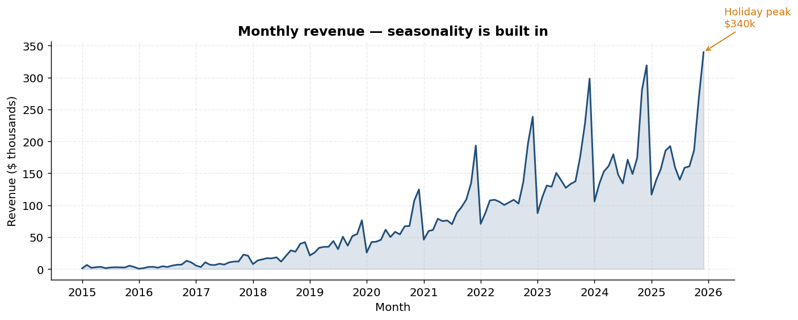
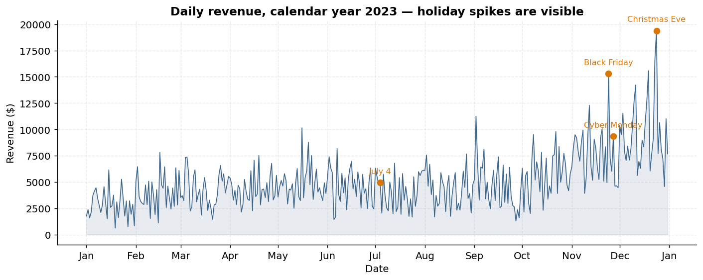
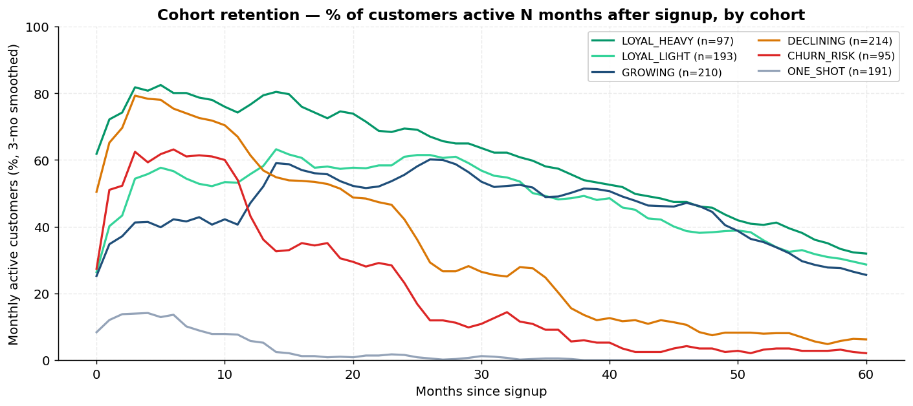
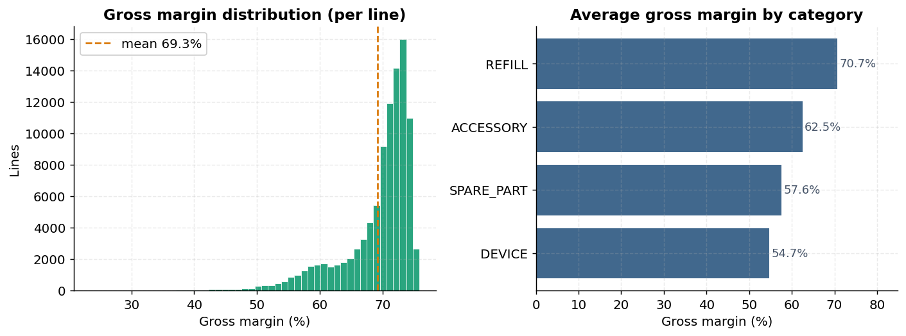
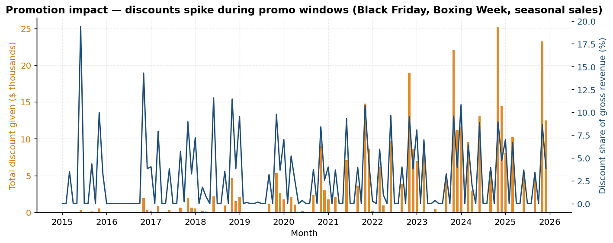
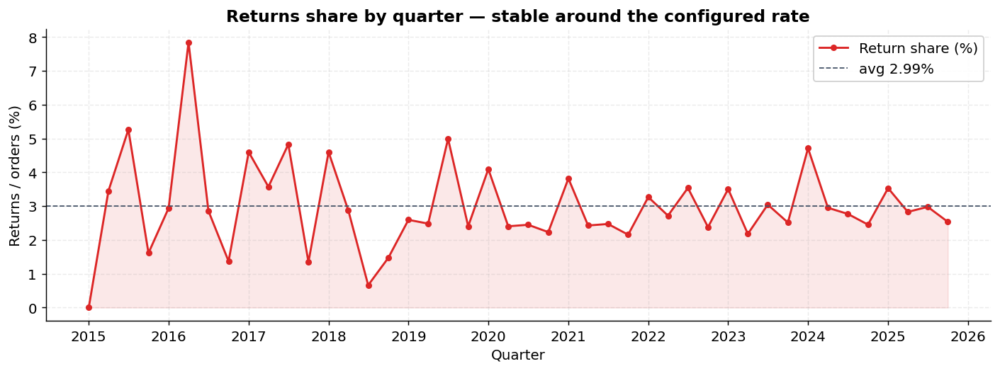
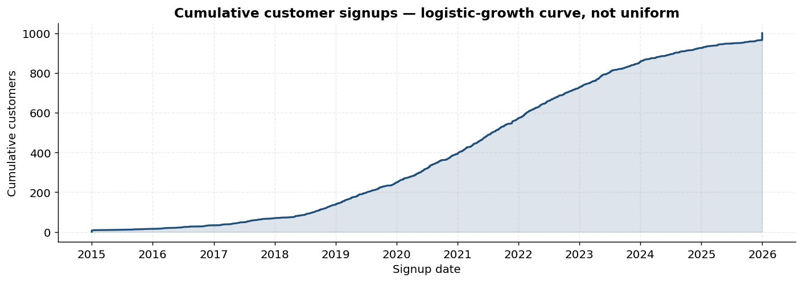
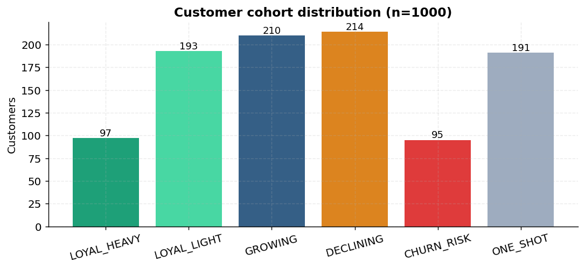
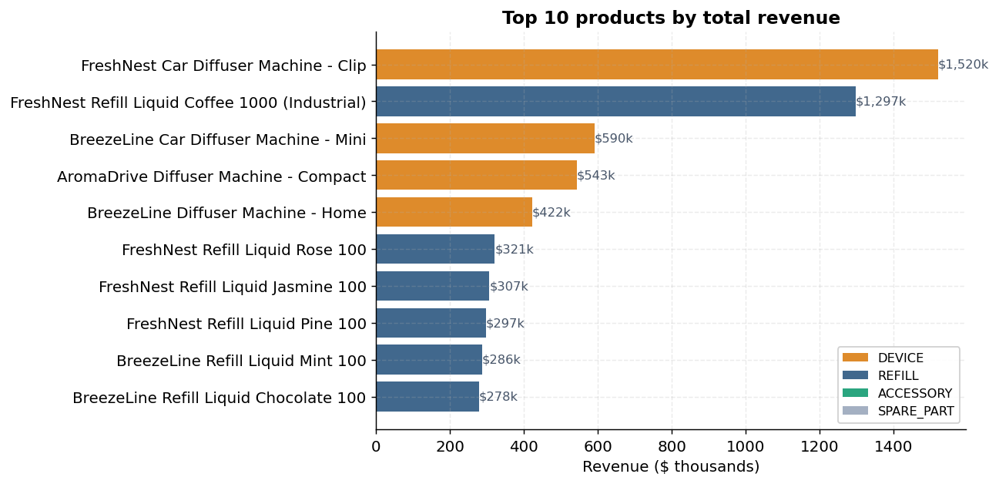

# 🛒 ERP Synthetic Data Generator

> **Realistic, multi-year, AdventureWorks-style retail data — generated from a single Python command, fully reproducible from a seed.**

A configurable synthetic data generator for retail/CRM/ERP analytics. Designed to look and feel like a real production dataset: invoice-level detail with line items, persistent customer cohorts, holiday seasonality, multi-market support (US / GCC / EU), promotions, returns, and inflation. Inspired by Microsoft's **AdventureWorks** schema and the **RetailSynth** behavioral simulator, packaged as a clean, dependency-light Python project.

[](https://www.python.org/) [](https://pandas.pydata.org/) [](https://numpy.org/) [](https://faker.readthedocs.io/) []()

---

## 📊 What it generates (in 60 seconds)

A single `python run.py` invocation produces an **AdventureWorks-style 6-table relational schema**:

| 1,000 customers | 100,627 sales lines | 11 years | $10.4M gross revenue |
|:-:|:-:|:-:|:-:|
| 98 SKUs across 4 categories | 52,620 invoices + 1,480 returns | 8 stores · 66 promotions | 65% gross margin |

### The numbers tell a story



> **Holiday seasonality is built in.** November and December consistently spike 2-3× above the baseline, year over year. The ramp from 2015 → 2025 reflects the logistic-growth signup curve that replaces the typical "uniform random" pattern.



> **Holiday calendar is real.** Black Friday, Cyber Monday, Christmas Eve, July 4th — every market gets its own holiday bumps. GCC swaps in Ramadan + Eid al-Fitr + Eid al-Adha, EU keeps Boxing Week.

---

## 🎯 Why this project is different

Most public retail datasets are either tiny (Iris, Wine), tabular without behavior (Northwind), or behaviorally flat (uniform random orders). This one was designed from the ground up to be **statistically realistic** along the axes that matter for analytics work:

| Axis | What's modeled |
|---|---|
| **Pricing** | `list_price` and `standard_cost` per SKU; price drifts by `(1 + inflation)^years_since_listing`; line-level discount when a promo is active |
| **Margins** | `gross_margin = line_total − line_cost` per line; category-specific cost ratios (DEVICE 55% · REFILL 35% · ACCESSORY 45% · SPARE_PART 50%) |
| **Seasonality** | `month_factor × dow_factor × holiday_bump` multiplier on daily buy probability |
| **Customer cohorts** | 6 persistent behavioral segments (LOYAL_HEAVY, LOYAL_LIGHT, GROWING, DECLINING, ONE_SHOT, CHURN_RISK) deterministically assigned per customer |
| **Demographics** | Gender, birth year, marital status, occupation, education, country-aware lognormal income, geography (city/region/postal) |
| **Promotions** | Master table with anchored events (Black Friday Week, Boxing Week, Ramadan Specials, Eid Sale) plus generic seasonal sales |
| **Returns** | ~3% of orders generate a linked return invoice 1–30 days later with negated quantities and money fields |
| **Inflation** | Multi-year price drift; standard_cost is **frozen** at listing time → realistic margin expansion as prices inflate |
| **Multi-market** | `--market {us,gcc,eu}` swaps locale, currency, VAT, payment methods, weekend definition (Sat/Sun vs Fri/Sat), and holiday calendar |
| **Reproducibility** | Single `--seed` drives all RNGs (numpy + python random + Faker + pandas); same seed → byte-identical CSVs |
| **Performance** | Streaming CSV writes, precomputed promo lookup tables, vectorized demographics — 1k customers × 11 years in ~70 seconds |

---

## 📈 What you can do with the data

The shipped sample (1,000 customers × 11 years, seed 42) supports every standard retail analysis out of the box:

### Cohort retention


> Six behavioral cohorts diverge cleanly on retention curves — exactly the kind of signal you'd train churn models on. `LOYAL_HEAVY` stays high, `ONE_SHOT` decays fast, `GROWING` ramps then plateaus.

### Gross margin distribution


> Margins vary by category in the right shape: refills are highest-margin (consumables), devices lowest (high COGS). Mean margins drift up over time because `standard_cost` is frozen at listing time while `list_price` inflates.

### Promotions & discount patterns


> Discount $ given (orange bars) grows with the customer base. Discount-as-% of revenue (blue line) clearly spikes during promo windows — easily 15–20% during Black Friday weeks vs. ~0% baseline.

### Returns


> Returns hold steady around the configured 3% rate (default `--p-return 0.03`). Earlier quarters are noisy due to small N; converges as the customer base grows.

### Customer growth curve


> Logistic-growth signups (slow start → ramp → plateau) — much more realistic than the uniform-random distribution most generators ship.

### Cohort distribution


> 6 cohorts at the configured weights. Crucially, **a customer's cohort is sticky** across the entire run — same `customer_id` always gets the same cohort, even on re-runs.

### Top SKUs


> Premium devices and bulk industrial refills dominate revenue, exactly as a real diffuser business would skew. SKU-level analysis is straightforward.

---

## 🗂 Schema (6 CSVs, fully relational)

```
                ┌─────────────┐
                │ promotions  │
                └──────▲──────┘
                       │ promotion_id
                       │
┌──────────┐   ┌───────┴────────┐    ┌──────────┐
│ stores   │◄──┤ invoice_headers├───►│customers │
└──────────┘   └───────▲────────┘    └──────────┘
   store_id           │ invoice_id     customer_id
                      │
                ┌─────┴───────┐    ┌──────────┐
                │ sales_lines ├───►│  items   │
                └─────────────┘    └──────────┘
                                    product_id
```

| File | Type | Rows | Key fields |
|---|---|---|---|
| **`items.csv`** | dim | 98 | `product_id` (PK), `subcategory`, `list_price`, `standard_cost`, `currency`, `listed_from_date`, `compatible_device_brand`, `is_active` |
| **`customers.csv`** | dim | 1,000 | `customer_id` (PK), demographics (`gender`, `birth_year`, `marital_status`, `occupation`, `yearly_income`, `education`, `num_children`, `house_owner_flag`), geography (`country`, `region`, `city`, `postal_code`), behavior (`cohort`, `price_sensitivity`, `brand_affinity`) |
| **`stores.csv`** | dim | 8 | `store_id` (PK), `country`, `region`, `city`, `opened_date`, `store_type` |
| **`promotions.csv`** | dim | 66 | `promotion_id` (PK), `discount_pct`, `category_scope`, `start_date`, `end_date` |
| **`invoice_headers.csv`** | fact | 54,100 | `invoice_id` (PK), `customer_id`+`store_id`+`promotion_id` (FKs), `order_date`+`ship_date`+`due_date`, `subtotal`, `discount_total`, `tax_amount`, `freight`, `grand_total`, `vat_rate`, `payment_method`, `is_return`, `reference_invoice_id` |
| **`sales_lines.csv`** | fact | 100,627 | `line_id` (PK), `invoice_id`+`product_id` (FKs), `quantity`, `unit_price`, `discount_pct`, `discount_amount`, `extended_amount`, `line_total`, `unit_standard_cost`, `line_cost`, `gross_margin` |

The header / line split mirrors AdventureWorks' `SalesOrderHeader / SalesOrderDetail`, with three dates per invoice (order/ship/due), full money decomposition (subtotal → discount → tax → freight → grand_total), and explicit gross-margin tracking on every line.

---

## 🚀 Try it in 30 seconds

```bash
git clone <this-repo>
cd erp-synthetic-data-generator
pip install pandas numpy Faker matplotlib

# Generate a fresh sample (US, 1k customers, 11 years, seed 42)
python run.py --seed 42 --market us --n-customers 1000 \
              --date-from 2015-01-01 --date-till 2025-12-31

# Verify integrity (schema, FKs, header/line totals reconciliation, ...)
python scripts/verify.py output_csv

# Render all 9 charts
python scripts/generate_charts.py output_csv docs/charts
```

A pre-built **sample dataset** lives in [`output_csv/sample/`](output_csv/sample/) so you can start exploring immediately — no run required.

```python
import pandas as pd
df = pd.read_csv("output_csv/sample/sales_lines.csv")
df.merge(pd.read_csv("output_csv/sample/invoice_headers.csv"), on="invoice_id") \
  .groupby(pd.to_datetime(df.order_date).dt.to_period("M")).line_total.sum()
```

---

## 🌍 Multi-market support

```bash
# Middle East: Arabic-locale Faker, AED, 5% VAT, Mada/COD payments,
# Friday-Saturday weekend, Ramadan + Eid seasonality
python run.py --seed 42 --market gcc --n-customers 1000

# Continental Europe: German-locale Faker, EUR, 20% VAT, multi-country
python run.py --seed 42 --market eu --n-customers 1000
```

| Market | Locale | Currency | VAT | Weekend | Big holidays |
|---|---|---|---|---|---|
| `us` | `en_US` | USD | 8.75% | Sat/Sun | Black Friday, Cyber Monday, Christmas, July 4 |
| `gcc` | `ar_AA` | AED | 5% | Fri/Sat | Ramadan, Eid al-Fitr, Eid al-Adha, UAE National Day |
| `eu` | `de_DE` | EUR | 20% | Sat/Sun | Christmas, Boxing Week, Black Friday |

Override any individual setting with CLI flags (`--vat-rate`, `--currency`, `--annual-inflation`, ...). Lunar calendar dates for Eid are hand-curated 2010–2030.

---

## 🧬 The customer behavior model

Each customer is permanently assigned to one of 6 cohorts via `random.Random(seed ^ customer_id)` — meaning **the same customer always gets the same cohort across runs.** Each cohort comes with a full behavior preset:

| Cohort | Buy prob (Yr 1→4) | Lost rate / day | Refill basket | Price sensitivity |
|---|---|---:|---|---:|
| 🟢 LOYAL_HEAVY (10%) | 6% → 10% | 0.0001 | up to 5 refills | 0.20 |
| 🟢 LOYAL_LIGHT (20%) | 3% → 5% | 0.0001 | 1–4 refills | 0.40 |
| 🔵 GROWING (20%) | 2% → 8% | 0.0002 | 1–4 refills | 0.55 |
| 🟠 DECLINING (20%) | 6% → 1% | 0.0003 | smaller | 0.70 |
| 🔴 CHURN_RISK (10%) | 4% → 0.5% | 0.0006 | small | 0.90 |
| ⚪ ONE_SHOT (20%) | spike → 0% | 0.0008 | small | 0.85 |

Daily buy probability is then modulated:

```python
p_buy_day = clip(
    cohort.p_buy_by_year[year_idx]            # cohort schedule
    × month_factor[month]                     # Nov 1.6, Dec 1.8, Jan 0.7, ...
    × dow_factor[dow]                         # weekend 1.15
    × holiday_bump(date)                      # Black Friday 2.5, Christmas 1.8, Eid 2.0
    × (1 - 0.20 × price_sensitivity),         # cautious buyers buy less
    0, 1
)
```

So a `LOYAL_HEAVY` customer on Black Friday in their fourth year buys with `p ≈ 31%`, while the same customer on a Tuesday in February buys with `p ≈ 8%`. The customer also has a sticky `brand_affinity` that filters their product pool toward one device family — so a "FreshNest" customer mostly buys FreshNest-compatible refills.

---

## 🛠 Architecture

```
src/
├── rng_utils.py    seeded RNGs (numpy + python random + Faker), threaded everywhere
├── markets.py      US/GCC/EU presets: locale, currency, VAT, holidays, dow factors
├── seasonality.py  combined_multiplier(date, market) → float
├── cohorts.py      6 sticky cohorts, deterministic per (seed, customer_id)
├── pricing.py      inflation-adjusted unit price + line-level promo discount
├── stores.py       store master generator
├── promotions.py   promotion master + precomputed (date, category) lookup
├── returns.py      negated-quantity return invoices linked via reference_invoice_id
├── items.py        product universe + sampler with list_price, standard_cost, …
├── customers.py    demographics, geography, cohort assignment, signup growth curve
└── sales.py        day-by-day per-customer (headers, lines) generation

scripts/
├── verify.py           one-command integrity / sanity checks
└── generate_charts.py  reproducible showcase chart pipeline

run.py                  CLI orchestrator
```

**Performance notes**:
- Promotions are precomputed into a `dict[(date_iso, category)] → (promo_id, pct)` once at startup, so the per-line lookup inside the hot loop is O(1) instead of an O(N) pandas filter.
- Sales output is **streamed** (append per customer) — flat memory regardless of `--n-customers`.
- Items' `listed_from_date` is parsed to a `date` object once and cached on the items index.
- Holiday tables are lazy-cached per year per market.

---

## ✅ Verification

`scripts/verify.py` exits non-zero on the first failure and runs:

| Check | What it validates |
|---|---|
| **Schema** | Exact column lists per file (drops/renames fail loudly) |
| **Column invariants** | `quantity` sign matches `is_return`; `unit_price > 0`; `discount_pct ∈ [0, 1]`; `gross_margin == line_total − line_cost` |
| **Foreign keys** | Every `invoice_id`, `customer_id`, `store_id`, `product_id`, `promotion_id`, `reference_invoice_id` resolves |
| **Header reconciliation** | For each invoice: `subtotal`, `discount_total`, `grand_total = subtotal − discount + tax + freight` (within ±0.05) |
| **Aggregate sanity** | Returns share ∈ [0.5%, 10%]; overall gross margin ∈ [10%, 70%] |
| **Cohort stickiness** | Each customer has exactly one cohort across the whole run |

Sample output on the shipped 1k×11y dataset:

```
Verifying output_csv/sample/
  schema: OK
  column invariants: OK
  FK integrity: OK
  totals reconciliation: OK
  return share: 2.81%
  overall gross margin: 65.01%
  cohort stickiness: OK
ALL CHECKS PASSED
```

**Reproducibility test:** run twice with the same seed, `sha256sum` matches across all 6 CSVs.

---

## ⚙️ CLI reference

<details>
<summary><strong>All flags</strong> (click to expand)</summary>

```
Scale & dates
  --n-customers INT          number of customers (default 1000)
  --date-from YYYY-MM-DD     start of customer creation timeline
  --date-till YYYY-MM-DD     end of generation timeline

Market & realism
  --seed INT                 master RNG seed (default 42)
  --market {us,gcc,eu}       locale, currency, VAT, holidays (default us)
  --vat-rate FLOAT           override market VAT
  --currency STR             override market currency
  --annual-inflation FLOAT   override market inflation rate

Items
  --n-devices INT            (default 5)
  --n-accessories INT        (default 10)
  --n-spare-parts INT        (default 8)
  --n-refills INT            (default 74)
  --n-bulk-refills INT       (default 1)

Customer fields
  --p-first-name FLOAT       (default 0.95)
  --p-last-name FLOAT        (default 0.85)
  --p-email FLOAT            (default 0.70)
  --p-phone FLOAT            (default 0.80)
  --p-email-opt-in FLOAT     (default 0.60, only if email present)
  --p-sms-opt-in FLOAT       (default 0.90, only if phone present)
  --p-call-opt-in FLOAT      (default 0.75, only if phone present)

Stores & promotions
  --n-stores INT             (default 8)
  --n-promotions-per-year INT (default 6)

Returns
  --p-return FLOAT           (default 0.03)
  --enable-returns / --disable-returns

Output
  --out-dir PATH             (default output_csv)
```

</details>

---

## 📚 References

This project draws design lessons from:

- **[AdventureWorks](https://learn.microsoft.com/en-us/sql/samples/adventureworks-install-configure)** (Microsoft) — header / line invoice split, three-date model, slowly-changing product dimensions, rich `DimCustomer` demographics
- **[RetailSynth](https://arxiv.org/abs/2312.14095)** (RetailMarketingAI) — customer-level latent variables, persistent price sensitivity, multi-stage purchase choice model
- **["Comprehensive Evaluation of Synthetic Retail Data"](https://arxiv.org/abs/2406.13130)** — fidelity, utility, and privacy benchmarks for synthetic retail datasets

---

## 📜 License

MIT. See [`LICENSE`](LICENSE).

---

## ⚠️ Disclaimer

All data produced by this project is **synthetic** and randomly generated. It does not contain real customer or company information.
